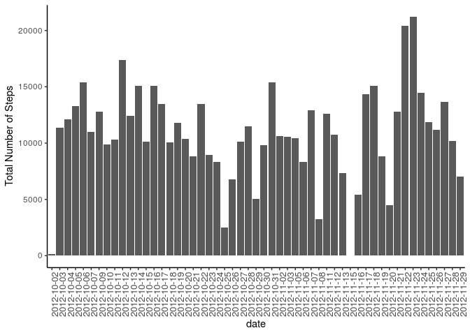
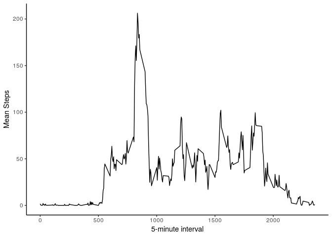
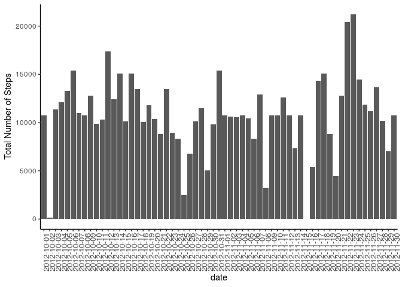
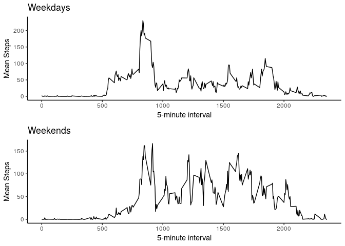

## Loading and preprocessing the data


```r
activities <- read.csv("~/activity.csv") #Read the database
activities$steps <- as.numeric(activities$steps)
```

Load the libraries

```r
library(dplyr)
library(ggplot2) 
```


## What is mean total number of steps taken per day?


```r
meanSteps <- activities %>%  filter(!is.na(steps)) %>% group_by(date) %>% summarise(Total.Steps = sum(steps), Mean.Steps = mean(steps), Median.Steps = median(steps))

ggplot(meanSteps, aes(x = date, y = Total.Steps)) + geom_bar(stat="identity") + theme_classic() + theme(axis.text.x=element_text(angle=90, size=10))  + ylab("Total Number of Steps")
```

<!-- -->

```r
meanSteps
```

```
## # A tibble: 53 x 4
##    date       Total.Steps Mean.Steps Median.Steps
##    <fct>            <dbl>      <dbl>        <dbl>
##  1 2012-10-02         126      0.438            0
##  2 2012-10-03       11352     39.4              0
##  3 2012-10-04       12116     42.1              0
##  4 2012-10-05       13294     46.2              0
##  5 2012-10-06       15420     53.5              0
##  6 2012-10-07       11015     38.2              0
##  7 2012-10-09       12811     44.5              0
##  8 2012-10-10        9900     34.4              0
##  9 2012-10-11       10304     35.8              0
## 10 2012-10-12       17382     60.4              0
## # … with 43 more rows
```


## What is the average daily activity pattern?


```r
min5 <- activities %>% filter(!is.na(steps)) %>% group_by(interval) %>% summarise(Mean.Steps = mean(steps))

ggplot(min5, aes(x=as.numeric(interval), y=Mean.Steps)) + geom_line() + theme_classic() + xlab("5-minute interval") + ylab("Mean Steps")
```

<!-- -->

```r
maxmin5 <- min5 %>% filter(Mean.Steps == max(Mean.Steps))

maxmin5
```

```
## # A tibble: 1 x 2
##   interval Mean.Steps
##      <int>      <dbl>
## 1      835       206.
```

Interval 835 has the maximum average number of steps at 206.2

## Imputing missing values

We will use the average number of steps by interval to fill the missing values


```r
activites2 <- left_join(activities, min5)
```

```
## Joining, by = "interval"
```

```r
activitiesFull <- activites2 %>% mutate(New.Steps = ifelse(is.na(steps), Mean.Steps, steps)) %>% select(-steps, -Mean.Steps) %>% rename(steps=New.Steps)

meanSteps <- activitiesFull %>%  filter(!is.na(steps)) %>% group_by(date) %>% summarise(Total.Steps = sum(steps), Mean.Steps = mean(steps), Median.Steps=median(steps))

ggplot(meanSteps, aes(x = date, y = Total.Steps)) + geom_bar(stat="identity") + theme_classic() + theme(axis.text.x=element_text(angle=90, size=10))  + ylab("Total Number of Steps")
```

<!-- -->

```r
meanSteps
```

```
## # A tibble: 61 x 4
##    date       Total.Steps Mean.Steps Median.Steps
##    <fct>            <dbl>      <dbl>        <dbl>
##  1 2012-10-01      10766.     37.4           34.1
##  2 2012-10-02        126       0.438          0  
##  3 2012-10-03      11352      39.4            0  
##  4 2012-10-04      12116      42.1            0  
##  5 2012-10-05      13294      46.2            0  
##  6 2012-10-06      15420      53.5            0  
##  7 2012-10-07      11015      38.2            0  
##  8 2012-10-08      10766.     37.4           34.1
##  9 2012-10-09      12811      44.5            0  
## 10 2012-10-10       9900      34.4            0  
## # … with 51 more rows
```


## Are there differences in activity patterns between weekdays and weekends?


```r
activitiesFull$day <- weekdays(as.Date(activitiesFull$date))
weekend <- c("Saturday", "Sunday")

activitiesFull <- activitiesFull %>%  mutate(type = ifelse(day == "Saturday", "weekend", ifelse(day == "Sunday", "weekend", "weekday")))

weekdays <- activitiesFull %>% filter(type == "weekday")
weekend <- activitiesFull %>% filter(type == "weekend")

min5wd <- weekdays %>% group_by(interval) %>% summarise(Mean.Steps = mean(steps))
min5we <- weekend %>% group_by(interval) %>% summarise(Mean.Steps = mean(steps))

wd <- ggplot(min5wd, aes(x=as.numeric(interval), y=Mean.Steps)) + geom_line() + theme_classic() + xlab("5-minute interval") + ylab("Mean Steps") + ggtitle("Weekdays")

we <- ggplot(min5we, aes(x=as.numeric(interval), y=Mean.Steps)) + geom_line() + theme_classic() + xlab("5-minute interval") + ylab("Mean Steps") + ggtitle("Weekends")

gridExtra::grid.arrange(wd, we)
```

<!-- -->

